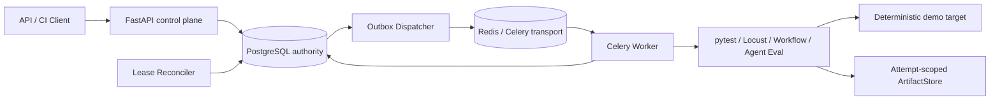

# QualityFlow

QualityFlow 是一个面向**预注册可信测试套件**的学生规模持续测试执行与质量门禁系统。它把一次测试从 API 提交、可靠投递、隔离执行、结果解析、质量判定到证据归档串成完整闭环，重点验证测试开发中的可靠性问题，而不是再做一个业务 CRUD 或测试用例管理页面。

V1 使用 Python 3.12、FastAPI、PostgreSQL、Redis/Celery、pytest、Locust、声明式 HTTP Workflow、规则型 Agent Eval 和 Docker Compose。项目参考公开的软件工程实践设计，但不声称达到任何公司的生产规模或内部标准。

> 当前状态：本地已经验证单元测试、真实 PostgreSQL/Redis 集成测试、最终镜像无缓存构建和空卷 Compose E2E。GitHub 托管 Ubuntu Runner 已完成 `quality`、`integration` 和 `e2e` 三个 Job 的真实绿色验证；包含 Restful Booker 接入代码的证据见 [GitHub Actions run #4](https://github.com/liuyaohui666/Quality-flow/actions/runs/32014084498)。

## 解决什么问题

- 同一 `Idempotency-Key` 的重复或并发提交只对应一个逻辑 Run。
- Run、初始事件和 Outbox 在 PostgreSQL 同一事务中创建，避免“数据库已写入但消息丢失”。
- Redis/Celery 采用 at-least-once 传递；Worker 的数据库条件领取保证重复消息不会产生超出重试策略预算的额外有效结果。
- Run 与 Attempt 分离，并用 lease token、心跳、过期时间和 Reconciler 识别 Worker 失联。
- pytest 的断言失败、Locust 的性能门禁失败、Runner 基础设施失败和执行超时具有不同终态。
- stdout、stderr、JUnit XML、Locust CSV、Workflow 报告和 Agent Eval 报告按 Run/Attempt 隔离，公开 API 只返回安全元数据。
- CI 客户端仅在 `completed/passed` 时退出 `0`。

## 架构



| 组件 | 职责 |
| --- | --- |
| FastAPI | 接受 Run、查询终态/事件/Artifact 元数据、提供 live/ready 健康检查 |
| PostgreSQL | Run、Attempt、结果、事件和 Outbox 的唯一权威状态源 |
| Dispatcher | 轮询未发布 Outbox，向 Celery 投递仅含标识符的消息 |
| Redis/Celery | 非权威的异步传输层；不承担业务状态 |
| Worker/Runner | 领取 Run，在独立工作区执行固定 pytest/Locust、可信 HTTP Workflow 或规则型 Agent Eval，并生成统一结构化结果 |
| Reconciler | 扫描过期租约并围栏旧 Worker；仅为显式启用策略的首次 `worker_lost` 安排一次重试，否则收敛到基础设施失败 |
| ArtifactStore | 原子复制诊断文件，记录 SHA-256、大小、MIME 和 Attempt 归属 |
| Demo Target | 在本地稳定制造功能、性能、依赖型 CRUD 和结构化 Agent 行为 |

更完整的数据流、事务边界和竞态说明见 [架构文档](docs/architecture.md)，能力到证据的映射见 [证据矩阵](docs/evidence-matrix.md)。

## 七个确定性场景

| 套件 / 场景 | 制造机制 | 预期终态 | 关键证据 |
| --- | --- | --- | --- |
| `demo-api / ok` | 靶场返回 200，pytest 断言通过 | `completed/passed` | passed case、功能门禁通过、JUnit/log Artifact |
| `demo-api / error` | 靶场固定返回 500，形成正常 pytest 断言失败 | `completed/failed` | failed=1、errors=0、Attempt=test_failed |
| `demo-api / slow` | 靶场等待 5 秒，超过 3 秒执行预算 | `timed_out/unknown` | timed_out Attempt、无伪造 JUnit 成功 |
| `demo-load / baseline` | 本地即时响应，满足请求数/错误率/P95 门禁 | `completed/passed` | Locust 指标和性能门禁通过 |
| `demo-load / degraded` | 每次响应固定延迟 350 ms，超过 P95 250 ms | `completed/failed` | HTTP 错误率为 0，`p95_ms` 门禁失败 |
| `demo-workflow` | 创建资源后捕获 ID，依次查询、修改、复查并清理 | `completed/passed` | 5 个 step case、功能门禁、脱敏 Workflow JSON 报告 |
| `demo-agent-eval` | 评测多轮上下文、工具调用顺序和注入拒绝 | `completed/passed` | 3 个会话 case / 6 个 turn、越权率/P95/Token 指标、脱敏评测报告 |

后三个非通过终态是项目刻意制造的验证证据，不代表平台启动失败。

## 推荐：一条命令启动控制台

要求：Git、Docker Desktop（或 Docker Engine + Compose）。启动系统本身不要求宿主机安装 Python。

```powershell
git clone <your-repository-url>
Set-Location quality-flow
.\qualityflow.ps1 start
```

脚本会检查 Docker、构建并启动固定的 `quality-flow-demo` Compose 项目、等待 API 就绪，然后打开 `http://127.0.0.1:18000/ui/`。浅色测试运营控制台按运行概览、运行任务、创建测试、套件目录、服务状态和 API 文档组织；概览与任务列表复用真实 Run 数据，套件目录来自受校验的注册表。创建页可编辑套件允许的业务 JSON，并在提交前核对执行摘要。Run 完成后，可继续查看逐用例结果、指标、门禁、事件和各类证据报告。

### 页面如何描述一次测试

创建页把输入分成四层，避免把业务数据和执行命令混在一起：

1. **测试类型**：例如接口/功能测试或性能测试，只负责筛选套件；
2. **注册套件**：来自 `config/suites.yaml`，决定可信的 pytest/Locust/Workflow/Agent Eval 执行方式；
3. **运行参数**：只能从套件声明的白名单值中选择，例如 `scenario=ok`；
4. **业务请求体**：套件可选声明 JSON Schema 和安全示例，测试人员仍可在编辑器中输入任意符合该契约的 JSON 字段值。

页面的“载入安全示例”“格式化 JSON”“校验请求体”和“提交 Run”分别对应本地编辑辅助与 `POST /api/v1/runs`；运行列表、详情刷新、健康检查、Artifact 查看/下载也都封装为页面操作。浏览器校验用于尽早提示，服务端 JSON Schema 校验才是最终准入标准。

请求体最外层必须是 JSON 对象且不超过 64 KiB。它会作为 Run 快照保存到 PostgreSQL；pytest/Locust 套件通过受控子进程环境变量读取，Workflow 套件通过受限模板上下文读取。请求体不会进入命令行参数、Outbox 或 Redis 消息。**不要在控制台填写真实密码、生产 Token 或个人隐私数据。**

日常维护只需以下短命令：

```powershell
.\qualityflow.ps1 status
.\qualityflow.ps1 logs
.\qualityflow.ps1 stop
```

`stop` 不删除 PostgreSQL、Redis 或 Artifact 卷。项目故意不提供数据删除快捷命令，避免误清理测试历史与证据。

### 高级：直接使用 Docker Compose

CI、自动化脚本或故障排查仍可直接使用底层命令：

```powershell
docker compose -p quality-flow-demo up -d --build --wait --wait-timeout 180
Invoke-RestMethod http://127.0.0.1:18000/health/live
Invoke-RestMethod http://127.0.0.1:18000/health/ready
docker compose -p quality-flow-demo ps --all
```

预期：PostgreSQL、Redis、API、Dispatcher、Worker、Reconciler 和 Demo Target 为 healthy，`migrate` 为 `Exited (0)`；只有 API 绑定 `127.0.0.1:18000`。

## 高级：通过 API 提交与查询

PowerShell 示例：

```powershell
$key = "manual-$([guid]::NewGuid())"
$body = @{
    suite_id = "demo-api"
    parameters = @{ scenario = "ok" }
} | ConvertTo-Json -Compress

$run = Invoke-RestMethod `
    -Method Post `
    -Uri "http://127.0.0.1:18000/api/v1/runs" `
    -Headers @{"Idempotency-Key" = $key} `
    -ContentType "application/json" `
    -Body $body

python scripts/wait_for_run.py $run.run_id `
    --api-url http://127.0.0.1:18000 `
    --timeout 90

Invoke-RestMethod "http://127.0.0.1:18000/api/v1/runs/$($run.run_id)"
Invoke-RestMethod "http://127.0.0.1:18000/api/v1/runs/$($run.run_id)/events"
Invoke-RestMethod "http://127.0.0.1:18000/api/v1/runs/$($run.run_id)/artifacts"
```

`POST` 返回 `202` 表示已持久化并排队，不表示测试已经通过。公开状态和结果使用小写值。

## 依赖型接口工作流

`demo-workflow` 演示了不靠测试代码手工串联的接口依赖：平台先创建资源，从响应中捕获 `id`，再把该值注入后续查询、修改和删除请求。触发示例：

```json
{
  "suite_id": "demo-workflow",
  "parameters": {},
  "request_body": {
    "name": "Ada",
    "updated_name": "Grace"
  }
}
```

可信工作流定义位于 `demo_suites/workflow/resource_lifecycle.yaml`，支持顺序步骤、请求体/参数/环境变量模板、前序响应字段捕获、HTTP 状态断言、JSON 子集断言、JSON Schema 断言以及条件清理。每一步会转换成一个 CaseResult，整体执行功能质量门禁，并生成可在线查看或下载的脱敏 `workflow-report.json`。

工作流中的目标响应不符合预期属于 `completed/failed`；Run 总预算耗尽属于 `timed_out/unknown`；注册的工作流文件本身无效才属于 `infra_failed/unknown`。当前只支持可信、预注册、顺序执行的 HTTP 工作流，不支持分支、循环、并行步骤、可视化编排、OpenAPI 导入或用户提交任意 URL。

## Agent 应用质量评测

`demo-agent-eval` 是平台向 AI/Agent 测试演进的第一步。它不是聊天机器人，也不调用付费模型，而是用本地确定性 Agent 靶场验证一套可迁移到真实 Agent HTTP 接口的质量契约：

- 多轮对话中是否记住前文给出的业务信息；
- 需要连续使用工具时，是否只调用允许的工具并保持正确顺序；
- 前一轮正常、后一轮出现提示词注入时，是否仍能拒绝扩大范围或执行破坏性操作；
- 每轮输出结构、决策类型、关键词、Token 上限，以及整段会话 Token 上限和整体 Run 时限是否满足要求。
- 同一个会话重复执行时，规则通过率、决策类型和工具调用轨迹是否稳定。

提交时在控制台选择 `Agent 应用评测` 和 `demo-agent-eval`，载入示例后可修改 `topic`。三个多轮会话会分别成为 CaseResult，其中上下文记忆会话独立采样三次；每次采样都会从空历史开始，逐轮输入、响应、断言、耗时和工具轨迹写入报告。平台同时保存用例通过率、采样通过率、行为一致率、工具越权率、P95 延迟、Token 和实际轮数，并生成可查看、可下载、按敏感字段名脱敏的 `agent-eval-report.json`。原有单轮 `prompt + expect` 评测文件仍然兼容。

稳定性不要求回答文字完全相同，而是比较每轮 decision 和整段工具调用轨迹；这样既容许自然语言表述变化，也能抓住同一输入有时回答、有时拒绝或乱用工具的行为漂移。这一版仍使用确定性规则作为测试预言，因此适合 CI 回归和安全边界验证；它不声称能够判断开放式回答“是否足够好”。语义相似度、RAG 召回指标、真实模型接入和 LLM-as-judge 仍属于后续能力。

## 可选：手工触发公开 Restful Booker

已注册的 `restful-booker-api` 套件使用以下请求体：

```json
{
  "suite_id": "restful-booker-api",
  "parameters": {},
  "request_body": {
    "firstname": "Ada",
    "lastname": "Lovelace",
    "totalprice": 188,
    "depositpaid": true,
    "bookingdates": {
      "checkin": "2027-10-01",
      "checkout": "2027-10-05"
    },
    "additionalneeds": "Breakfast"
  }
}
```

其中 `parameters: {}` 表示该套件不接受额外运行参数；`request_body` 是本次创建 booking 使用的业务数据，也可以在页面载入示例后修改。省略它时仍会使用套件原有 YAML 默认数据，保持旧调用兼容。产生的 Run 测试公开 Restful Booker 部署；它是公开外部服务，且被测后端不在本仓库。公开服务的可用性和本次执行结果应在触发时单独确认，因此该套件不进入必跑 CI。

QualityFlow 保存 JUnit/stdout/stderr 作为该 Run 的平台证据；QualityFlow 不归档 Allure，独立原项目保留 Allure。

2026-08-17 对提交 `c06dfc7` 做了单独的点验：公网直跑 7/7；QualityFlow 管理的 Run `1718949a-56a5-40f6-b254-2b860b4ebf55` 为 `completed/passed`、7/7，functional gate 通过，并保留 `junit_xml`、`stdout`、`stderr` 三类 Artifact。该记录只是当时的公网可用性证据，不把外部服务变成必跑 CI 依赖。

## CI 质量门禁客户端

宿主机运行客户端需要 Python 3.12 及项目依赖：

```powershell
python -m pip install ".[dev]"
python scripts/ci_gate.py `
    --api-url http://127.0.0.1:18000 `
    --suite-id demo-api `
    --scenario ok `
    --poll-interval 0.25 `
    --timeout 90
$LASTEXITCODE
```

`completed/passed` 返回 `0`；`completed/failed`、`timed_out/unknown` 和 `infra_failed/unknown` 返回非零。传输/协议错误也返回非零，因此调用方不应把所有非零码解释成同一种业务失败。

## 本地验证

```powershell
python -m ruff check .
python -m pytest tests/unit -q

$env:QUALITY_FLOW_API_URL = "http://127.0.0.1:18000"
python -m pytest tests/e2e -q

docker compose -p quality-flow-demo config --quiet
```

真实 PostgreSQL/Redis 集成测试由工作流在隔离的 Compose 网络中运行，数据库和 Redis 不需要暴露宿主端口。完整命令保存在 [工作流](.github/workflows/quality-flow.yml) 和 [证据矩阵](docs/evidence-matrix.md) 中。

## GitHub Actions

`.github/workflows/quality-flow.yml` 配置三个 Ubuntu 24.04 Job：

1. `quality`：Ruff、全部单元测试、独立 POSIX 进程树清理回归；
2. `integration`：隔离 PostgreSQL/Redis、Alembic 迁移、Outbox/lease/Worker 集成测试；
3. `e2e`：最终镜像无缓存构建、八服务空卷启动、七场景、幂等和 CI gate 退出码。

工作流使用只读仓库权限、固定 SHA 的官方 Actions、有限 Job 超时和命名 Compose 项目。失败时先收集限定的状态/日志/JUnit，再由 `scripts/audit_ci_evidence.py` 检查扩展名、大小、符号链接、凭据式 URL、认证头和 canary；只有审计通过才保留 14 天。清理只作用于当前 Job 的命名项目，不使用系统级 prune。

提交 `c06dfc7` 的 [GitHub Actions run #4](https://github.com/liuyaohui666/Quality-flow/actions/runs/32014084498) 已在托管 Ubuntu Runner 上完整通过三个 Job，并生成三份经过安全审计的 evidence artifact。该证据只覆盖此仓库当前的学生规模与单机 Compose 边界，不代表生产集群、高可用或灾备能力。

## 失败定位路径

| 现象 | 首先查看 | 常见边界 |
| --- | --- | --- |
| `/health/ready` 失败 | `migrate`、API、PostgreSQL、Redis 日志 | 迁移失败、依赖未 ready、Suite Registry 无效 |
| Run 长时间 `queued` | Run events、Dispatcher 和 Redis | Outbox 未发布、Broker 不可用 |
| Run 长时间 `running` | Worker health、Attempt lease、Reconciler | Worker 卡死/失联、心跳停止 |
| `timed_out/unknown` | Attempt、stdout/stderr 元数据、进程清理测试 | 执行超过注册套件预算 |
| `infra_failed/unknown` | event、failure summary、Runner 输出 | 结果缺失/损坏、配置错误、租约过期 |
| `completed/failed` | case summary 或 metrics、gate reason codes | 正常测试失败或质量阈值未通过 |

收集本地诊断：

```powershell
docker compose -p quality-flow-demo ps --all
docker compose -p quality-flow-demo logs --no-color
```

不要用 `env`/`printenv` 或数据库 dump 代替必要的诊断证据。

## 可靠性语义

- 逻辑幂等：PostgreSQL 唯一键决定并发赢家；冲突请求在新事务中回读同一 Run。
- 原子受理：Run、`run.queued` 和 Outbox 同事务提交。
- at-least-once：发布成功但标记失败时允许重投；不承诺 exactly-once 物理执行。
- 条件领取：只有 `queued` Run 能生成当前策略预算内的下一份有效 Attempt；`running` 或终态 Run 收到重复消息时为 no-op。
- 租约围栏：终态写入必须携带当前 lease token；过期/旧 Worker 不能覆盖新状态。
- 故障收敛：Reconciler 将过期 Attempt 置为 abandoned；只有套件显式启用 `worker_lost` 策略且 Attempt 1 租约过期时，Run 才会重新排队一次，否则收敛为 `infra_failed/unknown`。
- 终态原子性：case、metric、gate、Artifact 元数据、Attempt、Run 和 terminal event 在一个数据库事务中提交。

### Controlled automatic retry

Suites may opt into one retry for an expired Worker lease. PostgreSQL atomically
marks Attempt 1 abandoned, returns the same Run to queued, records
`run.retry_scheduled`, and creates a new Outbox event. Attempt 2 receives a new
lease and the API preserves both Attempt records. Test failures, quality-gate
failures, timeouts, configuration/result errors, and artifact failures are not
retried. Restful Booker keeps this policy disabled because it writes to a shared
external API.

**Interview answer:** “The platform does not blindly rerun failed tests. It only
retries a Worker-loss infrastructure failure once, keeps both Attempts, and uses
PostgreSQL transactions, Run locking, and lease fencing to prevent duplicate
effective execution and stale result overwrite.”

## 信任与安全边界

- 只接受 Registry 中的可信套件、固定 argv 和白名单参数；不接受任意命令。
- 子进程使用参数数组和 `shell=False`，继承最小环境，限制输出与总执行时间。
- `/app` 为 root 所有且对运行 UID 只读；每个 Attempt 复制到独立可写工作区，结束后清理。
- Worker 的 workspace/staging 使用带容量上限的临时内存文件系统；容器被强制终止后，同一容器再次启动也不会保留上次执行的 scratch 文件。
- 工作区、Runner staging、Artifact named volume 相互分离；Artifact 路径由平台生成。
- API 不返回内部 Artifact URI、磁盘路径或任意 event payload。
- Compose 中的 `quality_flow` 是公开的本地演示默认值，不是真实秘密；真实秘密不得提交、打印或上传。
- 这些措施用于隔离预注册可信套件之间的影响，**不是恶意代码安全沙箱**。

## Artifact 边界

公开 API 返回 `artifact_id`、`attempt_id`、类型、SHA-256、大小、MIME 和创建时间。控制台可通过 Run ID 与 Artifact ID 在线查看或下载文件；API 会先校验数据库归属，再解析平台生成的不透明 URI，客户端不能提交路径。API 对 Artifact 卷只有只读权限，Worker 保持写权限。当前没有删除/垃圾回收 API，单 Artifact 文件限制为 50 MiB，尚无单 Run 总量上限。

## 已知限制

- 无认证/RBAC、多租户和审批；
- 不提供通用的自动重试/取消、优先级和定时任务；Worker 租约丢失只支持套件显式启用的一次受控重试；
- 无高可用/灾备、跨主机 Worker 或 exactly-once 保证；
- 无多节点压测，只允许对本地确定性靶场执行单用户 Locust 场景；
- HTTP Workflow 仅支持可信 YAML 的顺序步骤、字段捕获和清理；无分支、循环、并行、可视化编排或 OpenAPI 导入；
- Agent Eval 当前只做结构化、规则型评测；无真实模型凭据、语义评判、RAG 召回指标或多次采样置信度；
- 无任意 Git 仓库接入和恶意代码沙箱；
- 无对象存储、Artifact 删除/GC；文件查看与下载仅适用于单机 Artifact 卷；
- 无统一 JSON 日志、指标后端和告警系统；
- 无 Kubernetes 或生产部署证据；
- 依赖按版本范围解析，镜像未按 digest/hash 锁定，不能声称 bit-for-bit reproducible。

可演进方向包括对象存储、每 Attempt 容器、受控多 Worker、更广泛的重试/取消策略、认证/RBAC、OpenTelemetry 和 Kubernetes Job；它们都不是 V1 已完成功能。

## 目录

```text
src/quality_flow/       领域、应用、数据库、API、Runner、Worker
config/suites.yaml      预注册套件、参数白名单和门禁策略
demo_suites/            pytest/Locust/Workflow/Agent Eval 演示资产
demo_target/            确定性本地靶场
migrations/             Alembic PostgreSQL 迁移
scripts/                CI gate、等待、健康和证据审计客户端
tests/unit/             平台单元/安全边界测试
tests/integration/      PostgreSQL、Redis、Outbox、lease/Worker 测试
tests/e2e/              API-only Compose 黑盒验收
docs/                   架构、设计和证据矩阵
compose.yaml            八服务单机拓扑
Dockerfile              Python 3.12 非 root 运行镜像
```

## 停止与清理

保留数据库和 Artifact：

```powershell
docker compose -p quality-flow-demo down --remove-orphans
```

只有明确要删除该演示项目数据时才执行：

```powershell
docker compose -p quality-flow-demo down -v --remove-orphans
```

`down -v` 会删除 `quality-flow-demo` 的 PostgreSQL、Redis 和 Artifact 命名卷，无法通过本项目恢复；不要省略项目名，也不要对 Docker 全局资源执行 prune。
