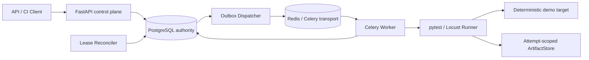

# QualityFlow

QualityFlow 是一个面向**预注册可信测试套件**的学生规模持续测试执行与质量门禁系统。它把一次测试从 API 提交、可靠投递、隔离执行、结果解析、质量判定到证据归档串成完整闭环，重点验证测试开发中的可靠性问题，而不是再做一个业务 CRUD 或测试用例管理页面。

V1 使用 Python 3.12、FastAPI、PostgreSQL、Redis/Celery、pytest、Locust 和 Docker Compose。项目参考公开的软件工程实践设计，但不声称达到任何公司的生产规模或内部标准。

> 当前状态：本地已经验证单元测试、真实 PostgreSQL/Redis 集成测试、最终镜像无缓存构建和空卷 Compose E2E。GitHub 托管 Ubuntu Runner 已完成 `quality`、`integration` 和 `e2e` 三个 Job 的真实绿色验证；具体证据见 [GitHub Actions run #2](https://github.com/liuyaohui666/Quality-flow/actions/runs/32006807495)。

## 解决什么问题

- 同一 `Idempotency-Key` 的重复或并发提交只对应一个逻辑 Run。
- Run、初始事件和 Outbox 在 PostgreSQL 同一事务中创建，避免“数据库已写入但消息丢失”。
- Redis/Celery 采用 at-least-once 传递；Worker 的数据库条件领取保证重复消息不会产生第二份有效结果。
- Run 与 Attempt 分离，并用 lease token、心跳、过期时间和 Reconciler 识别 Worker 失联。
- pytest 的断言失败、Locust 的性能门禁失败、Runner 基础设施失败和执行超时具有不同终态。
- stdout、stderr、JUnit XML 和 Locust CSV 按 Run/Attempt 隔离，公开 API 只返回安全元数据。
- CI 客户端仅在 `completed/passed` 时退出 `0`。

## 架构



| 组件 | 职责 |
| --- | --- |
| FastAPI | 接受 Run、查询终态/事件/Artifact 元数据、提供 live/ready 健康检查 |
| PostgreSQL | Run、Attempt、结果、事件和 Outbox 的唯一权威状态源 |
| Dispatcher | 轮询未发布 Outbox，向 Celery 投递仅含标识符的消息 |
| Redis/Celery | 非权威的异步传输层；不承担业务状态 |
| Worker/Runner | 领取 Run，在独立工作区执行固定 pytest/Locust 命令并生成结构化结果 |
| Reconciler | 扫描过期租约，围栏旧 Worker，将失联执行收敛到基础设施失败 |
| ArtifactStore | 原子复制诊断文件，记录 SHA-256、大小、MIME 和 Attempt 归属 |
| Demo Target | 只在本地稳定制造成功、断言失败、超时和 P95 退化 |

更完整的数据流、事务边界和竞态说明见 [架构文档](docs/architecture.md)，能力到证据的映射见 [证据矩阵](docs/evidence-matrix.md)。

## 五个确定性场景

| 套件 / 场景 | 制造机制 | 预期终态 | 关键证据 |
| --- | --- | --- | --- |
| `demo-api / ok` | 靶场返回 200，pytest 断言通过 | `completed/passed` | passed case、功能门禁通过、JUnit/log Artifact |
| `demo-api / error` | 靶场固定返回 500，形成正常 pytest 断言失败 | `completed/failed` | failed=1、errors=0、Attempt=test_failed |
| `demo-api / slow` | 靶场等待 5 秒，超过 3 秒执行预算 | `timed_out/unknown` | timed_out Attempt、无伪造 JUnit 成功 |
| `demo-load / baseline` | 本地即时响应，满足请求数/错误率/P95 门禁 | `completed/passed` | Locust 指标和性能门禁通过 |
| `demo-load / degraded` | 每次响应固定延迟 350 ms，超过 P95 250 ms | `completed/failed` | HTTP 错误率为 0，`p95_ms` 门禁失败 |

后三个非通过终态是项目刻意制造的验证证据，不代表平台启动失败。

## 只用 Git 和 Docker 启动

要求：Git、Docker Desktop（或 Docker Engine + Compose）。启动系统本身不要求宿主机安装 Python。

```powershell
git clone <your-repository-url>
Set-Location quality-flow
docker compose -p quality-flow-demo up -d --build --wait --wait-timeout 180
Invoke-RestMethod http://127.0.0.1:18000/health/live
Invoke-RestMethod http://127.0.0.1:18000/health/ready
docker compose -p quality-flow-demo ps --all
```

预期：PostgreSQL、Redis、API、Dispatcher、Worker、Reconciler 和 Demo Target 为 healthy，`migrate` 为 `Exited (0)`；只有 API 绑定 `127.0.0.1:18000`。

## 手动提交与查询

PowerShell 示例：

```powershell
$key = "manual-$([guid]::NewGuid())"
$body = @{
    suite_id = "demo-api"
    parameters = @{ scenario = "ok" }
} | ConvertTo-Json -Compress

$run = Invoke-RestMethod `
    -Method Post `
    -Uri "http://127.0.0.1:18000/api/v1/runs" `
    -Headers @{"Idempotency-Key" = $key} `
    -ContentType "application/json" `
    -Body $body

python scripts/wait_for_run.py $run.run_id `
    --api-url http://127.0.0.1:18000 `
    --timeout 90

Invoke-RestMethod "http://127.0.0.1:18000/api/v1/runs/$($run.run_id)"
Invoke-RestMethod "http://127.0.0.1:18000/api/v1/runs/$($run.run_id)/events"
Invoke-RestMethod "http://127.0.0.1:18000/api/v1/runs/$($run.run_id)/artifacts"
```

`POST` 返回 `202` 表示已持久化并排队，不表示测试已经通过。公开状态和结果使用小写值。

## CI 质量门禁客户端

宿主机运行客户端需要 Python 3.12 及项目依赖：

```powershell
python -m pip install ".[dev]"
python scripts/ci_gate.py `
    --api-url http://127.0.0.1:18000 `
    --suite-id demo-api `
    --scenario ok `
    --poll-interval 0.25 `
    --timeout 90
$LASTEXITCODE
```

`completed/passed` 返回 `0`；`completed/failed`、`timed_out/unknown` 和 `infra_failed/unknown` 返回非零。传输/协议错误也返回非零，因此调用方不应把所有非零码解释成同一种业务失败。

## 本地验证

```powershell
python -m ruff check .
python -m pytest tests/unit -q

$env:QUALITY_FLOW_API_URL = "http://127.0.0.1:18000"
python -m pytest tests/e2e -q

docker compose -p quality-flow-demo config --quiet
```

真实 PostgreSQL/Redis 集成测试由工作流在隔离的 Compose 网络中运行，数据库和 Redis 不需要暴露宿主端口。完整命令保存在 [工作流](.github/workflows/quality-flow.yml) 和 [证据矩阵](docs/evidence-matrix.md) 中。

## GitHub Actions

`.github/workflows/quality-flow.yml` 配置三个 Ubuntu 24.04 Job：

1. `quality`：Ruff、全部单元测试、独立 POSIX 进程树清理回归；
2. `integration`：隔离 PostgreSQL/Redis、Alembic 迁移、Outbox/lease/Worker 集成测试；
3. `e2e`：最终镜像无缓存构建、八服务空卷启动、五场景、幂等和 CI gate 退出码。

工作流使用只读仓库权限、固定 SHA 的官方 Actions、有限 Job 超时和命名 Compose 项目。失败时先收集限定的状态/日志/JUnit，再由 `scripts/audit_ci_evidence.py` 检查扩展名、大小、符号链接、凭据式 URL、认证头和 canary；只有审计通过才保留 14 天。清理只作用于当前 Job 的命名项目，不使用系统级 prune。

提交 `63d012f` 的 [GitHub Actions run #2](https://github.com/liuyaohui666/Quality-flow/actions/runs/32006807495) 已在托管 Ubuntu Runner 上完整通过三个 Job，并生成三份经过安全审计的 evidence artifact。该证据只覆盖此仓库当前的学生规模与单机 Compose 边界，不代表生产集群、高可用或灾备能力。

## 失败定位路径

| 现象 | 首先查看 | 常见边界 |
| --- | --- | --- |
| `/health/ready` 失败 | `migrate`、API、PostgreSQL、Redis 日志 | 迁移失败、依赖未 ready、Suite Registry 无效 |
| Run 长时间 `queued` | Run events、Dispatcher 和 Redis | Outbox 未发布、Broker 不可用 |
| Run 长时间 `running` | Worker health、Attempt lease、Reconciler | Worker 卡死/失联、心跳停止 |
| `timed_out/unknown` | Attempt、stdout/stderr 元数据、进程清理测试 | 执行超过注册套件预算 |
| `infra_failed/unknown` | event、failure summary、Runner 输出 | 结果缺失/损坏、配置错误、租约过期 |
| `completed/failed` | case summary 或 metrics、gate reason codes | 正常测试失败或质量阈值未通过 |

收集本地诊断：

```powershell
docker compose -p quality-flow-demo ps --all
docker compose -p quality-flow-demo logs --no-color
```

不要用 `env`/`printenv` 或数据库 dump 代替必要的诊断证据。

## 可靠性语义

- 逻辑幂等：PostgreSQL 唯一键决定并发赢家；冲突请求在新事务中回读同一 Run。
- 原子受理：Run、`run.queued` 和 Outbox 同事务提交。
- at-least-once：发布成功但标记失败时允许重投；不承诺 exactly-once 物理执行。
- 条件领取：只有 `queued` Run 能生成第一份有效 Attempt；重复消息为 no-op。
- 租约围栏：终态写入必须携带当前 lease token；过期/旧 Worker 不能覆盖新状态。
- 故障收敛：Reconciler 将过期 Attempt 置为 abandoned，将 Run 置为 `infra_failed/unknown`，V1 不自动重试。
- 终态原子性：case、metric、gate、Artifact 元数据、Attempt、Run 和 terminal event 在一个数据库事务中提交。

## 信任与安全边界

- 只接受 Registry 中的可信套件、固定 argv 和白名单参数；不接受任意命令。
- 子进程使用参数数组和 `shell=False`，继承最小环境，限制输出与总执行时间。
- `/app` 为 root 所有且对运行 UID 只读；每个 Attempt 复制到独立可写工作区，结束后清理。
- Worker 的 workspace/staging 使用带容量上限的临时内存文件系统；容器被强制终止后，同一容器再次启动也不会保留上次执行的 scratch 文件。
- 工作区、Runner staging、Artifact named volume 相互分离；Artifact 路径由平台生成。
- API 不返回内部 Artifact URI、磁盘路径或任意 event payload。
- Compose 中的 `quality_flow` 是公开的本地演示默认值，不是真实秘密；真实秘密不得提交、打印或上传。
- 这些措施用于隔离预注册可信套件之间的影响，**不是恶意代码安全沙箱**。

## Artifact 边界

公开 API 返回 `artifact_id`、`attempt_id`、类型、SHA-256、大小、MIME 和创建时间。V1 **不提供 Artifact 文件下载接口**，也没有删除/垃圾回收 API；文件只保存在 Worker 的本地命名卷。当前限制是单 Artifact 文件 50 MiB，尚无单 Run 总量上限。

## 已知限制

- 无认证/RBAC、多租户和审批；
- 无自动重试/取消、优先级和定时任务；
- 无高可用/灾备、跨主机 Worker 或 exactly-once 保证；
- 无多节点压测，只允许对本地确定性靶场执行单用户 Locust 场景；
- 无任意 Git 仓库接入和恶意代码沙箱；
- 无对象存储、Artifact 下载/删除/GC；
- 无统一 JSON 日志、指标后端和告警系统；
- 无 Kubernetes 或生产部署证据；
- 依赖按版本范围解析，镜像未按 digest/hash 锁定，不能声称 bit-for-bit reproducible。

可演进方向包括对象存储、每 Attempt 容器、受控多 Worker、重试/取消、认证/RBAC、OpenTelemetry 和 Kubernetes Job；它们都不是 V1 已完成功能。

## 目录

```text
src/quality_flow/       领域、应用、数据库、API、Runner、Worker
config/suites.yaml      预注册套件、参数白名单和门禁策略
demo_suites/            pytest/Locust 演示资产
demo_target/            确定性本地靶场
migrations/             Alembic PostgreSQL 迁移
scripts/                CI gate、等待、健康和证据审计客户端
tests/unit/             平台单元/安全边界测试
tests/integration/      PostgreSQL、Redis、Outbox、lease/Worker 测试
tests/e2e/              API-only Compose 黑盒验收
docs/                   架构、设计和证据矩阵
compose.yaml            八服务单机拓扑
Dockerfile              Python 3.12 非 root 运行镜像
```

## 停止与清理

保留数据库和 Artifact：

```powershell
docker compose -p quality-flow-demo down --remove-orphans
```

只有明确要删除该演示项目数据时才执行：

```powershell
docker compose -p quality-flow-demo down -v --remove-orphans
```

`down -v` 会删除 `quality-flow-demo` 的 PostgreSQL、Redis 和 Artifact 命名卷，无法通过本项目恢复；不要省略项目名，也不要对 Docker 全局资源执行 prune。
