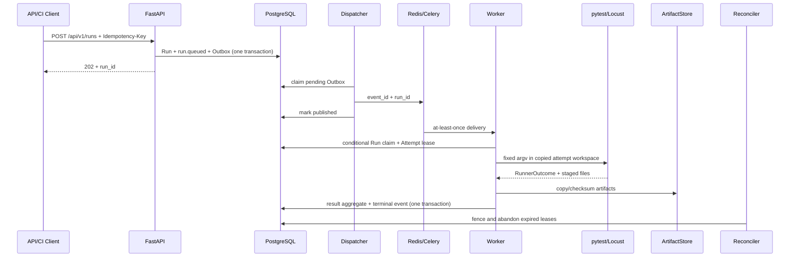

# QualityFlow V1 架构与可靠性边界

## 1. 定位

QualityFlow 是单机、模块化控制面加独立执行进程的持续测试演示系统。它只运行版本库中预注册的可信套件，目标是把可靠受理、异步执行、失败分类、质量门禁和证据归档做成可验证闭环。

它不是测试管理 UI、通用任务平台、生产调度系统，也不是恶意代码安全沙箱。

## 2. 进程与权威状态



PostgreSQL 是唯一权威状态源。Redis/Celery 只传递标识符，不拥有 Run 或 Attempt 状态。Redis 丢失一条尚未确认的消息时，PostgreSQL 中未发布的 Outbox 仍可重投。

## 3. 启动顺序与健康

Compose 启动顺序：

1. PostgreSQL 和 Redis 各自通过健康检查；
2. `migrate` 执行 `alembic upgrade head` 并以 0 退出；
3. API、Dispatcher、Worker、Reconciler 才启动；Worker 还等待 Demo Target ready；
4. API `/health/live` 仅证明进程存活；`/health/ready` 同步检查 PostgreSQL、有限超时的 Redis ping 和非空 Registry；
5. Dispatcher 健康需要最近一次数据库轮询心跳加有限 Redis ping；Worker 需要有限 Celery node ping；Reconciler 需要最近一次数据库轮询心跳。

只有 API 发布到宿主 `127.0.0.1:18000`。PostgreSQL、Redis 和 Demo Target 仅通过 Compose DNS 访问。

## 4. 受理与逻辑幂等

`POST /api/v1/runs` 必须携带 `Idempotency-Key`。服务先读取 Registry 并生成不可变的 suite/gate 快照，再在同一事务中创建：

- Run（初始 `queued/unknown`）；
- `run.queued` 事件；
- 待发布 Outbox。

数据库对幂等键建立唯一约束。两个并发事务都认为键不存在时，只有一个 INSERT 能提交；失败方回滚后在新事务快照中读取赢家。因此逻辑上返回同一 Run，不依赖 Redis 分布式锁。

## 5. Outbox 与重复投递

Dispatcher 先在 PostgreSQL 记录发布尝试，再向 Celery 发布 `event_id` 和 `run_id`。只有发布调用返回后才标记完成。

如果消息实际已发出、但数据库标记提交失败，Outbox 会再次投递。这是 at-least-once，不是 exactly-once。Worker 只在 Run 仍为 `queued` 时原子领取指定 `run_id`；重复 delivery 不能创建第二个有效 Attempt 或第二份终态聚合。

## 6. Run/Attempt、租约与竞态围栏

Run 是一次逻辑测试；Attempt 是一次物理领取。领取时同时：

- Run：`queued -> running`；
- 创建 Attempt：`running`；
- 生成不可预测 lease token；
- 写入 heartbeat 与 lease expiry；
- 追加 `run.started`。

执行期间 heartbeat 使用 Attempt ID + lease token 的条件更新。终态事务也必须携带同一 token。Reconciler 对过期租约加锁并再次检查 token/expiry；成功后将 Attempt 置 `abandoned`，Run 置 `infra_failed/unknown`。旧 Worker 随后提交时因 token/终态不匹配而被拒绝。

V1 不自动重试，也不承诺物理测试进程绝不启动两次；它保证重复消息不会形成第二份有效业务结果。

## 7. Runner 与执行边界

统一接口：

```text
run(execution_spec, workspace) -> RunnerOutcome
```

Registry 只允许固定 `suite_id`、runner 类型、argv 模板、参数取值、超时和 gate policy。API 不接受原始命令。Worker 从 Run 快照读取源目录，把可信源复制到 `/runtime/workspaces/<run>/<attempt>`，再执行参数数组和 `shell=False`。

子进程获得最小环境；stdout/stderr 并发排空且有大小上限；heartbeat 受控；整体使用硬超时。POSIX 使用进程组、Windows 使用 Job Object 处理后代进程。结果文件先复制到 Runner 管理的 staging，再解析，避免套件在解析前替换链接或文件。

`/app` 在镜像中为 root 所有且对 UID 10001 只读；Attempt workspace、staging 和 Artifact root 相互分离。Worker 的 workspace/staging 是分别限额的 tmpfs，正常执行由 `finally` 清理，容器遭强制终止后则由 tmpfs 的重启语义清空；需要保留的 Artifact 单独写入 named volume。

这些措施隔离可信套件的正常副作用，**不是恶意代码安全沙箱**：同一容器内的恶意代码仍可能访问进程可见的网络和资源。

## 8. 结果、门禁与终态

PytestRunner 生成并解析 JUnit XML；LocustRunner 解析聚合 CSV。RunnerOutcome 包含 Attempt 状态、退出码、时间、case/metric、gate、Artifact 源和失败分类。

主要终态：

| Run | Outcome | 含义 |
| --- | --- | --- |
| `completed/passed` | 可信执行完成且 gate 通过 | CI 退出 0 |
| `completed/failed` | 断言或质量 gate 失败 | 有可信质量结论，CI 非零 |
| `timed_out/unknown` | 超过执行预算 | 无通过/失败质量结论，CI 非零 |
| `infra_failed/unknown` | Runner、结果、Artifact 或 Worker lease 失败 | 平台未得到可信质量结论，CI 非零 |

功能门禁使用通过率和最大失败数；性能门禁使用最少请求数、最大错误率和 P95。`demo-load / degraded` 的 HTTP 请求本身成功，但 P95 超阈值，因此是 `completed/failed`，不是基础设施错误。

case、metric、gate、Artifact 元数据、Attempt、Run 和 `run.finished` 在同一终态事务中持久化。受约束失败时全部回滚。

## 9. Artifact 数据流

Runner 只返回 staging 中已验证的普通文件。FileArtifactStore：

1. 验证源属于 Runner staging，拒绝 symlink/reparse point 和越界；
2. 以文件描述符重新确认打开对象；
3. 流式计算 SHA-256 和大小，执行单 Artifact 文件 50 MiB 上限；
4. 写入服务拥有目录中的临时文件并原子替换；
5. 返回内部 URI 和安全元数据供数据库登记。

公开 API 只返回安全元数据：Artifact/Attempt ID、类型、checksum、size、MIME、created_at。它不返回内部 URI/路径，也**不提供 Artifact 文件下载接口**。V1 的单 Run 总量限制与垃圾回收尚未实现。

## 10. 公开接口

- `POST /api/v1/runs`：只接受 suite ID 和白名单参数；要求 `Idempotency-Key`；返回 202。
- `GET /api/v1/runs/{run_id}`：Run/Attempt、case summary、metrics、gates、Artifact 元数据。
- `GET /api/v1/runs/{run_id}/events`：白名单化状态事件字段。
- `GET /api/v1/runs/{run_id}/artifacts`：路径无关的 Artifact 元数据。
- `GET /health/live`、`GET /health/ready`：存活和依赖就绪。

公开 wire 值为小写；数据库内部状态仍由显式枚举和 CHECK constraint 保护。

## 11. 日志和诊断

V1 使用 Compose/进程文本日志，不声称统一 JSON 结构化日志。Runner stdout/stderr 按 Attempt 归档；Outbox 发布失败日志包含 event/run UUID 和尝试次数，但不包含 broker 异常文本或 URL。数据库时间戳、RunEvent、Outbox publish attempts、lease 时间和健康状态共同提供定位线索。

推荐顺序：API Run/Events -> Compose role health/logs -> case/metric/gate -> Artifact 元数据。CI 只保留 allowlist 文件，上传前扫描扩展名、大小、链接、认证头、凭据式 URL 和 canary。

## 12. 当前边界

- 单主机 Compose、单 Worker concurrency；无高可用/灾备。
- 无认证/RBAC、多租户、retry/cancel 和调度。
- Redis 无 HA，且不是权威状态源。
- Locust 仅单用户、本地确定性靶场；无多节点压测。
- Artifact 仅本地 named volume；无下载、删除、对象存储和 GC。
- Python 依赖有版本范围，容器标签未按 digest 锁定；不是 bit-for-bit reproducible。
- GitHub Actions 已在托管 Ubuntu Runner 上完成 quality/integration/e2e 三 Job 绿色验证，但只覆盖当前提交和学生规模边界。
- 无 Kubernetes 或生产部署证据。

这些限制是刻意控制的学生项目范围，而不是隐藏的生产承诺。
